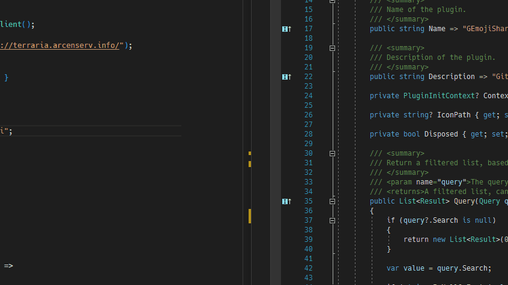

# Terraria JP Wiki Search for PowerToys Run

A Terraria JP Wiki Search for PowerToys Run. Simply invoke the command `guid` and get a freshly generated Guid to use.

## Installation

**Minimum required version of PowerToys is 0.53.1 - make sure you've got this version installed.**

Exit PowerToys, and save [naari3.TrJpWiki.zip](https://github.com/naari3/terraria-ja-wiki-PowerToysRun/releases/download/1.0.0/naari3.TrJpWiki.zip) to `%PROGRAMFILES%\PowerToys\modules\launcher\Plugins` (or wherever your PowerToys is installed), and start PowerToys.

## Usage

Open up PowerToys Run, and type the command prefix `trjp` and what word you want to search(example: `trjp Gold`). It will shows search result on WIki. Select the one you want, and press Enter to open that page on Browser.

## Contributing

Pull requests are welcome. For major changes, please open an issue first to discuss what you would like to change.

## License

[MIT](https://choosealicense.com/licenses/mit/)
